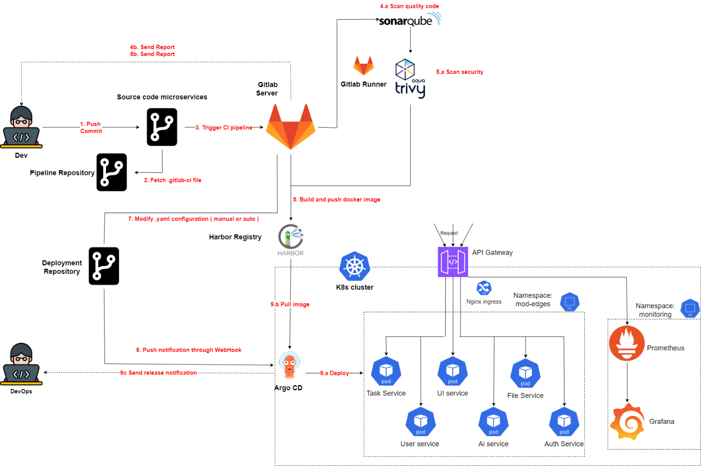

# Building a Deployment Process Based on Microservice Architecture

This repository showcases a DevOps project focusing on automating the deployment process for applications built on a microservice architecture. The project emphasizes Continuous Integration/Continuous Deployment (CI/CD), containerization, orchestration, and monitoring within Kubernetes.

## Overview

- **Project Title (Vietnamese):** Xây dựng quy trình triển khai tự động dựa trên kiến trúc microservice  
- **Project Title (English):** Building a Deployment Process Based on Microservice Architecture  
- **Institution:** University of Information Technology, VNU-HCM  
- **Department:** Computer Networks and Communications  
- **Authors:**  
  - Ngô Vũ Minh Đạt – 21521935  
  - Nguyễn Đoàn Khắc Huy – 21522151  
- **Supervisor:** Ths. Lê Anh Tuấn  

## Objectives

- Apply theoretical knowledge to a practical project.
- Establish a comprehensive DevOps CI/CD pipeline integrated with Kubernetes.
- Implement real-time logging, notifications

## Features

1. **Microservice Architecture:**
   - Services split into independent repositories.
   - Each service packaged with its configurations and dependencies.
2. **CI/CD Pipelines:**
   - Code scanning and quality assurance using SonarQube.
   - Docker image builds and pushes to a private Harbor registry.
   - Deployment automation using GitLab CI/CD and ArgoCD.
3. **Kubernetes Orchestration:**
   - Cluster setup on OpenStack using RKE2.
   - Deployment of microservices with configurations for scaling and networking.
4. **Monitoring and Alerting:**
   - Prometheus for resource metrics collection.
   - Grafana dashboards for visualization.
   - Notifications via Telegram.

## Technologies Used

- **CI/CD Tools:** GitLab CI/CD, ArgoCD, SonarQube
- **Containerization:** Docker
- **Orchestration:** Kubernetes (RKE2), Rancher
- **Monitoring:** Prometheus, Grafana
- **Private Registry:** Harbor
- **Edge Computing:** Jetson Nano (for IoT integrations)

## System Architecture

The architecture includes:
- Multiple microservices deployed in a Kubernetes cluster.
- Integration with GitLab for CI/CD pipelines.
- Monitoring and logging systems with Prometheus and Grafana.

## Setup Instructions

## Demo

- Video walkthrough: [Demo Link](https://www.youtube.com/watch?v=Y8S3SCFxAU0&feature=youtu.be)

## Project Milestones

1. **Research Phase (Jan 2024 - Feb 2024):**
   - Studied microservices architecture and basic implementations.
2. **Infrastructure Setup (Feb 2024 - Mar 2024):**
   - Established infrastructure using OpenStack.
3. **CI Pipeline Development (Mar 2024 - Apr 2024):**
   - Implemented CI pipelines for code scanning and builds.
4. **CD Integration (Apr 2024 - May 2024):**
   - Automated deployments with ArgoCD and integrated security features.
5. **Final Report (May 2024 - Jun 2024):**
   - Documented findings and prepared final reports.